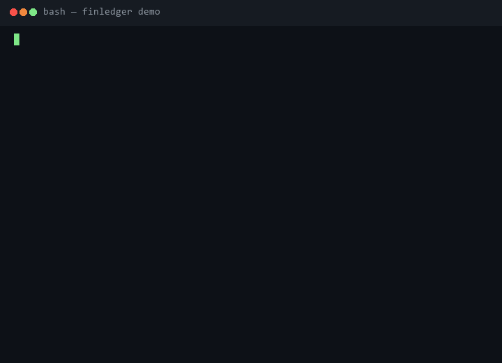
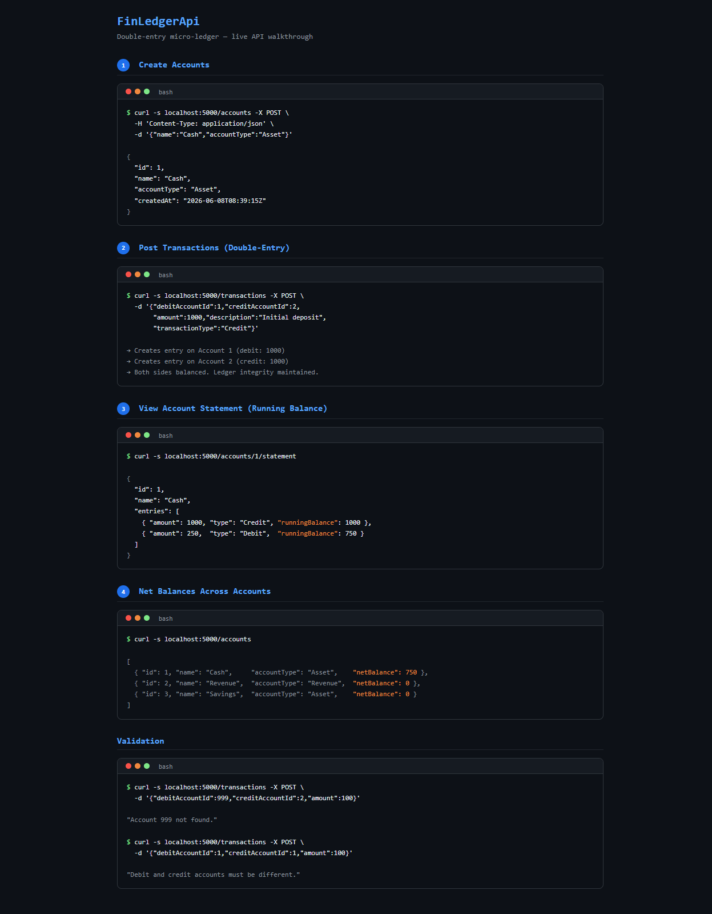

# FinLedgerApi

**Double-entry micro-ledger API built with .NET 9 Minimal APIs**


---

## Overview

A lightweight, self-contained accounting API that implements double-entry bookkeeping. Every transaction creates balanced debit and credit entries, maintaining ledger integrity at the application level. No external database required — runs entirely in-memory.

## Problem

Most demo APIs treat financial operations as simple CRUD. Real accounting systems need **double-entry bookkeeping**: every debit has a matching credit, running balances must be chronological, and net positions must be queryable across accounts. This project solves that with clean domain modeling on a minimal stack.

## Features

- **Double-entry transactions** — each operation creates paired debit/credit entries across two accounts
- **Running balance** — account statements show cumulative balance per entry, in chronological order
- **Net balance aggregation** — `GET /accounts` returns the computed net position for every account
- **Validation** — rejects same-account transfers, missing accounts, and invalid amounts
- **In-memory persistence** — EF Core InMemory provider, zero setup, restart-safe for demos
- **Integration tests** — 8 tests covering all endpoints via `WebApplicationFactory`

## Architecture

```
┌─────────────┐    HTTP    ┌──────────────────────────┐   EF Core   ┌──────────────┐
│   Client     │ ────────→ │   Minimal API (.NET 9)   │ ─────────→ │  InMemory DB │
│  curl / any  │ ←──────── │                          │ ←───────── │              │
└─────────────┘    JSON    │  POST /accounts          │            │  Accounts    │
                           │  POST /transactions      │            │  Transactions│
                           │  GET /accounts            │            │  Entries     │
                           │  GET /accounts/{id}/stmt  │            └──────────────┘
                           └──────────────────────────┘
```

See [architecture.svg](docs/assets/architecture.svg) for the full diagram.

## Tech Stack

| Layer | Technology |
|-------|-----------|
| Runtime | .NET 9 |
| API Framework | ASP.NET Core Minimal APIs |
| ORM | Entity Framework Core 9 (InMemory provider) |
| Testing | xUnit + `WebApplicationFactory<Program>` |
| Language | C# |

## Setup

```bash
# Prerequisites: .NET 9 SDK
# https://dotnet.microsoft.com/download/dotnet/9.0

# Clone
git clone https://github.com/binadacode/FinLedgerApi.git
cd FinLedgerApi

# Run
dotnet run
# App starts on http://localhost:5000

# Test
dotnet test
```

## Usage

### Create accounts

```bash
curl -s localhost:5000/accounts -X POST \
  -H 'Content-Type: application/json' \
  -d '{"name":"Cash","accountType":"Asset"}'

curl -s localhost:5000/accounts -X POST \
  -H 'Content-Type: application/json' \
  -d '{"name":"Revenue","accountType":"Revenue"}'
```

### Post a transaction

```bash
curl -s localhost:5000/transactions -X POST \
  -H 'Content-Type: application/json' \
  -d '{
    "debitAccountId": 1,
    "creditAccountId": 2,
    "amount": 1000,
    "description": "Initial deposit",
    "transactionType": "Credit"
  }'
```

### View account statement

```bash
curl -s localhost:5000/accounts/1/statement
```

Response includes chronological entries with `runningBalance`:

```json
{
  "id": 1,
  "name": "Cash",
  "entries": [
    { "amount": 1000, "type": "Credit", "runningBalance": 1000 },
    { "amount": 250,  "type": "Debit",  "runningBalance": 750 }
  ]
}
```

### Get all accounts with net balances

```bash
curl -s localhost:5000/accounts
```

## Demo





## Endpoints

| Method | Path | Description |
|--------|------|-------------|
| `POST` | `/accounts` | Create a new account |
| `GET` | `/accounts` | List all accounts with net balances |
| `POST` | `/transactions` | Create a double-entry transaction |
| `GET` | `/accounts/{id}/statement` | Account statement with running balance |

### Request/Response Reference

**POST /transactions** — request body:

```json
{
  "debitAccountId": 1,
  "creditAccountId": 2,
  "amount": 1000.00,
  "description": "string",
  "transactionType": "Credit | Debit | Transfer"
}
```

**Validation rules:**
- `debitAccountId` and `creditAccountId` must reference existing accounts
- `debitAccountId != creditAccountId`
- `amount` must be positive

## Future Improvements

- SQLite/PostgreSQL provider for persistent storage
- Date-range filtering on statements
- Account balance snapshots for audit
- API authentication (JWT)
- OpenAPI/Swagger UI
- Pagination on account lists

## Author

**Binada Matara Arachchige**
CS undergraduate — AI + full-stack systems

[github.com/binadacode](https://github.com/binadacode)

## License

MIT
